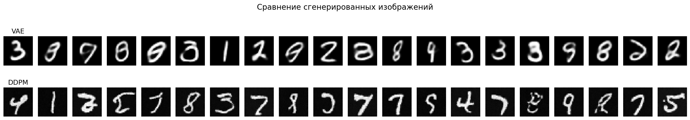
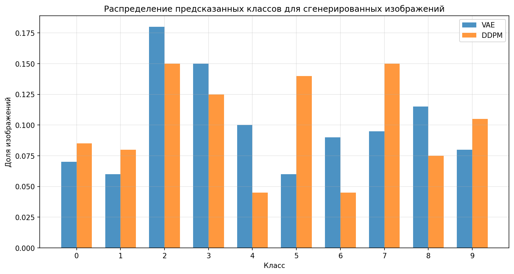

# Исследование качества изображений, сгенерированных VAE и диффузионной моделью

Выполнил: Шайдуров Даниил Сергеевич

## 1. Введение и постановка задачи

В данном проекте проводится сравнительное исследование двух популярных подходов к генерации изображений: вариационного автоэнкодера (VAE) и диффузионной вероятностной модели (DDPM). Цель работы - оценить качество генерируемых изображений, выявить сильные и слабые стороны каждого подхода, а также предложить метрики для объективного сравнения.

**Актуальность:** Генеративные модели находят широкое применение в компьютерном зрении, обработке естественного языка и других областях. Понимание различий между разными архитектурами помогает выбирать наиболее подходящий инструмент для конкретной задачи.

## 2. Описание моделей

### 2.1 Вариационный автоэнкодер (VAE)

VAE состоит из двух основных компонентов:
- **Энкодер** - сжимает входное изображение в скрытое представление (латентное пространство) размерности 20
- **Декодер** - восстанавливает изображение из скрытого представления

**Принципиальная идея:** Модель учится представлять данные в непрерывном латентном пространстве, где близкие точки соответствуют похожим изображениям. При генерации мы семплируем случайные векторы из этого пространства и пропускаем через декодер.

### 2.2 Диффузионная модель (DDPM)

DDPM работает в два этапа:
- **Прямой процесс** - постепенное добавление гауссовского шума к изображению в течение T шагов (в моей реализации T=500)
- **Обратный процесс** - обучение нейросети (U-Net) восстанавливать изображение из зашумленной версии, последовательно убирая шум

**Принципиальная идея:** Модель учится обращать процесс добавления шума, что позволяет генерировать новые изображения, начиная с чистого шума и постепенно его "очищая".

## 3. Эксперимент

### 3.1 Датасет
- **MNIST** - рукописные цифры от 0 до 9
- Размер изображений: 28×28 пикселей (градации серого)
- Количество классов: 10
- Обучающая выборка: 60000 изображений
- Тестовая выборка: 10000 изображений

### 3.2 Методология
1. Обучение VAE на тренировочных данных (15 эпох)
2. Обучение DDPM на тех же данных (10 эпох)
3. Генерация изображений каждой моделью
4. Оценка качества с помощью предобученного классификатора (точность на тестовых данных: 98.92%)

### 3.3 Метрики качества
Для оценки использовались следующие метрики:
- **Средняя уверенность классификатора** - чем выше, тем больше изображения похожи на реальные
- **Доля изображений с уверенностью > 0.8** - показатель количества "хороших" генераций
- **Энтропия распределения классов** - мера разнообразия генераций (чем ниже, тем более "уверен" классификатор)
- **Визуальный анализ** - субъективная оценка качества и разнообразия

## 4. Результаты

### 4.1 Количественные результаты

| Метрика | VAE | DDPM |
|---------|-----|------|
| Средняя уверенность | 0.8792 | **0.9236** |
| Доля изображений с уверенностью > 0.8 | 0.7500 | **0.8450** |
| Энтропия | 0.3370 | **0.2053** |

### 4.2 Анализ результатов

**Диффузионная модель (DDPM) показала лучшие результаты по всем метрикам:**

1. **Средняя уверенность классификатора** у DDPM (0.9236) выше, чем у VAE (0.8792), что говорит о более высоком качестве генерируемых изображений и их большей похожести на реальные образцы.

2. **Доля "хороших" генераций** (уверенность > 0.8) у DDPM составляет 84.5%, что значительно превышает показатель VAE (75.0%). Это означает, что DDPM генерирует более стабильно качественные изображения.

3. **Энтропия** у DDPM (0.2053) ниже, чем у VAE (0.3370), что указывает на большую уверенность классификатора в своих предсказаниях для изображений, сгенерированных диффузионной моделью.

### 4.3 Визуальный анализ

**Наблюдаемые различия:**

- **VAE**: генерирует более размытые изображения с менее четкими границами цифр. Некоторые сгенерированные образцы трудно идентифицировать даже человеку. Однако VAE демонстрирует хорошую способность к интерполяции между различными классами цифр в латентном пространстве.

- **DDPM**: создает более четкие и детализированные изображения с лучшей проработкой структуры цифр. Процесс обратной диффузии позволяет модели постепенно уточнять детали, что приводит к более качественным результатам. Даже "плохие" генерации DDPM часто выглядят как искаженные, но узнаваемые цифры.

 

**Примеры с низкой уверенностью:**
- У VAE проблемные генерации часто представляют собой сильно размытые или неразборчивые образцы
- У DDPM низкая уверенность обычно связана с необычным начертанием цифры, но сама цифра остается узнаваемой

### 4.4 Особенности моделей

**VAE:**
- Преимущества: быстрое обучение, компактное латентное представление, возможность интерполяции
- Недостатки: размытость изображений, менее четкие границы

**DDPM:**
- Преимущества: высокое качество генерации, четкие детали, хорошая проработка структуры
- Недостатки: медленное обучение, более сложная архитектура, длительный процесс генерации

 

## 5. Выводы

1. **Диффузионная модель превосходит VAE** по качеству генерации изображений на датасете MNIST, что подтверждается как количественными метриками, так и визуальным анализом.

2. **Выбор модели зависит от задачи:**
   - Для задач, где важна скорость и возможность работы в латентном пространстве (интерполяция, поиск похожих изображений), VAE остается хорошим выбором
   - Для задач, где критично качество генерации и есть вычислительные ресурсы, DDPM показывает лучшие результаты

3. **Перспективы дальнейших исследований:**
   - Использование более сложных архитектур (условная генерация, latent diffusion)
   - Применение на более сложных датасетах (CIFAR-10, CelebA)
   - Исследование компромисса между качеством и скоростью генерации
   - Комбинирование подходов (например, использование VAE для сжатия в латентное пространство и диффузии в нем)

## 6. Заключение

Проведенное исследование наглядно демонстрирует преимущества диффузионных моделей перед VAE в задаче генерации изображений. Полученные результаты (средняя уверенность 0.9236 против 0.8792) подтверждают, что DDPM создает более качественные и реалистичные изображения. Однако VAE сохраняет свою актуальность благодаря компактному латентному представлению и возможности интерполяции, что делает его удобным инструментом для определенных классов задач.